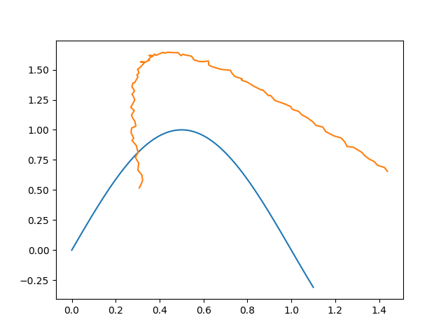
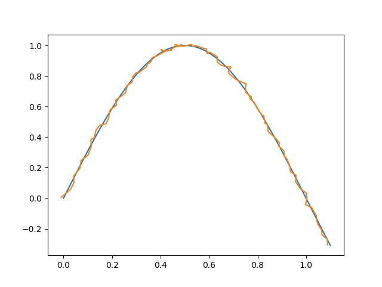

# iterative_closest_point_2d
Inspired by http://stackoverflow.com/questions/20120384/iterative-closest-point-icp-implementation-on-python
Forked from https://github.com/KojiKobayashi/iterative_closest_point_2d and converted to Python3 and OpenCV4

A 2D implementation of the Iterative Closest Points algorithm. It takes 2 sets of 2D points and returns
a transformation matrix. Applying said transformation to the second set of points will translate, rotate
and scale them in such a way that the overall distance between the two shapes is as low as possible.




# Required pacakges
To use this script you will need numpy and OpenCV with its non free components. 

You can use pip to install them:

```
pip install numpy opencv-contrib-python
```

# Usage
Call like this,
```python
ret = icp(d1, d2)
```

`d1, d2` are numpy array of 2d points.

The return value `ret` is the convert matrix with 2 rows and 3 coloums.

`icp` estimates rotation, moving, scaling(each x and y Separately) convertion.
